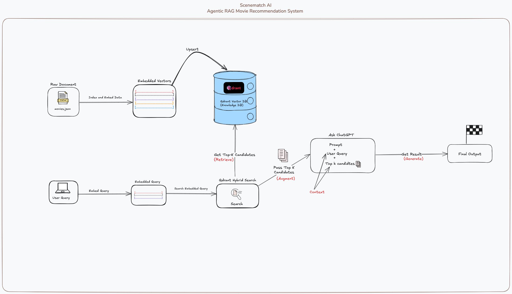
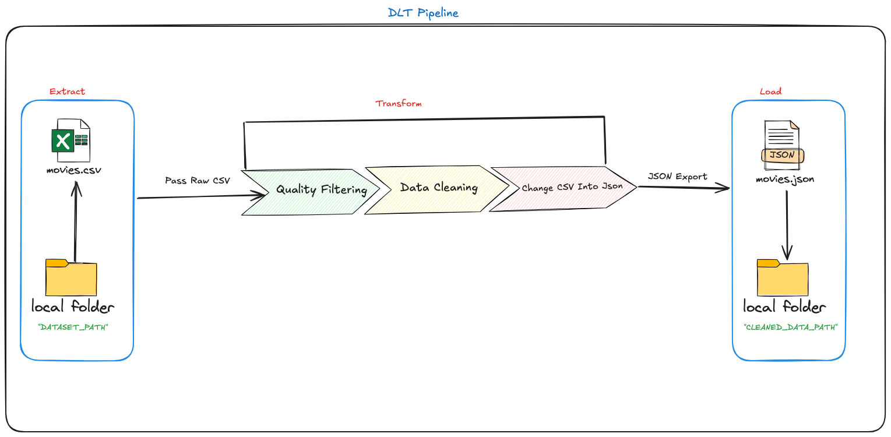

# Scenematch AI – System Components  

---
## 0. Design 

####  Here is the design of our system:


---

# Scenematch Python Packages and Their Purpose

## 1. Clients Package

### Purpose  
Centralized client management for external services.

### Components  
- **`client_setup.py`** – creates and configures API clients for OpenAI and Qdrant, performs connection validation, and handles error management.  
- Extensible design lets you plug in additional service clients (other LLM providers, vector databases).

### Key Functions  
| Function | Description |
| -------- | ----------- |
| `create_qdrant_local_client()` | Returns a local Qdrant client after running health checks. |
| `create_openai_client()` | Instantiates an authenticated OpenAI client. |

### Configuration

``` python
.env # to store API key
OPENAI_API_KEY=sk-your-api-key
QDRANT_URL=http://localhost:6333 # default

```

### Basic Usage

```python
from scenematch.clients.client_setup import create_qdrant_local_client, reate_openai_client

qdrant_client = create_qdrant_local_client() 
openai_client = create_openai_client()

```

---

## 2. Data Preparation Package

### dtl pipeline flow




### Purpose  
End-to-end ETL pipeline that converts raw movie CSV data into vector-ready JSON.

### Main Module  
- **`dlt_pipe.py`** – production pipeline built with the `DLT` framework.

### Supporting Files  
- `data_cleaning.ipynb` – exploratory analysis & testing.  
- `prepare_data.py` – early prototype / scratch implementation.

### Data Schema (key fields)  
`title`, `overview`, `genres`, `keywords`, `vote_average`, `vote_count`,  
`release_date`, `runtime`, `original_language`, `popularity`

### Pipeline Process  
1. **Load** CSV with pandas.  
2. **Filter** for quality films (`rating > 5.8` AND `votes > 100`).  
3. **Clean** text fields; convert `genres`/`keywords` to Python lists.  
4. **Add** a UUID to every record.  
5. **Export** cleaned JSON ready for embedding.

**Data Flow**

`Raw CSV (more than 1M records) → Quality Filtering → Data Cleaning → JSON Export (~14k records)`

#### `Extract` from `DATASET_PATH (movies.csv)` and `LOAD` the `Transformed` data `(movies.json)` to `CLEANED_DATA_PATH`

```
DATASET_PATH="/path/to/movies.csv"
CLEANED_DATA_PATH="/path/to/output/"
```


---

## 3. Evaluation Package

### Purpose  
Assess retrieval quality via an LLM-as-a-Judge framework.

### Components  
- **`metrics.py`** – retrieval metrics implementation.  
- **`evaluation.md`** – conceptual documentation.  
- **`llm_judge.py`** – runs LLM relevance scoring.

### Evaluation Workflow  
1. **Retrieve** top-k results for each test query.  
2. **Judge** relevance (LLM returns 1 or 0).  
3. **Calculate** metrics using these judgments as ground truth.

### Metrics Implemented  
| Metric | What it measures |
| ------ | ---------------- |
| `precision_at_k` | Relevance quality within top-k hits. |
| `recall` | Coverage of all relevant items. |
| `reciprocal_rank` | Rank position of the first relevant hit. |
| `hit_rate_k` | Binary indicator: at least one hit in top-k. |


> Generation evaluation is skipped because generation is used only for reranking.


---


## 4. Monitoring Package

### Purpose  
Collect user feedback and visualize analytics.

### Grafana Stack

**Key Files**  
- `docker-compose.yaml` – spins up Grafana.  
- `datasources.yaml` – pre-configures a PostgreSQL data source (`feedback_db`).

### Features  
- Live dashboard of user ratings.  
- Distribution plot (1–5 stars).  
- Recent feedback table.  
- Usage-pattern metrics.

### Quick Start  

```bash
cd monitoring/grafana-stack
docker-compose up -d
```

```bash
Open http://localhost:3000 (login: admin / admin) 
```

### Datasource setup (Grafana ↔ PostgreSQL)

1. Open `monitoring/grafana-stack/datasources.yaml` and note:  
   - `url` (host)  
   - `database`  
   - `user`  
   - `password`

2. In PostgreSQL, **create a super-user** using the same `user` and `password` values.

3. Log in to Grafana and navigate to 

   **Connections → Data sources → Add new data source**  
   (or go directly to <http://localhost:3000/connections/datasources/new>).

4. Select **PostgreSQL** and fill in the form with the values from `datasources.yaml`.

   | Grafana field | YAML key |
   | ------------- | -------- |
   | Host URL      | `url` |
   | Database name | `database` |
   | Username      | `user` |
   | Password      | `password` |

5. Click **Save & Test** and confirm the message “*Data source is working.*”

---

## 5. rag package

### Purpose  
Implementation of a retrieval-augmented generation (RAG) stack.
Within this package you can:

- Index: create a Qdrant collection tailored for movie data.

- Embed: generate dense and sparse vectors for each film and upsert them as points.

- Search: run hybrid (dense + BM25) queries that fuse scores for better recall.

- Chat: launch a lightweight MovieBot that detects intent, fetches relevant movies, and responds through an LLM.


### Module: `agentic_chat.py`

| Function | Purpose |
| -------- | ------- |
| `detect_intent(openai_client, user_input)` | Classifies the message as **`movie_recommendation`** or **`general_chat`** via a quick OpenAI call. |
| `chat_with_openai(user_input, results, openai_client)` | Builds a prompt (using `build_prompt`), blends in any retrieved movie data (`results`), and returns the LLM’s reply. |
| `run_chatbot_loop(collection_name, qdrant_client, openai_client)` | Interactive CLI loop: reads user input, calls `detect_intent`, performs search when needed, and prints the response. |

**Flow:**  
`user_input → detect_intent → (multi_stage_search if needed) → chat_with_openai → reply`

### Module: `collection_config.py`

| Function | Purpose |
| -------- | ------- |
| `create_my_collection(client, collection_name, embedding_dim=512)` | Deletes any existing Qdrant collection with the same name, then creates a fresh collection that includes:<br>• **5 dense vector fields** (`*_dense`, cosine distance, `embedding_dim` each).<br>• **4 sparse BM25 fields** (`*_sparse_bm25`, IDF-weighted).<br>• Optional HNSW index tuning (`m=32`, `ef_construct=128`).<br>Logs progress to the console. |

**Dense fields:** `overview_dense`, `tagline_dense`, `keywords_dense`, `cast_dense`, `director_dense`  
**Sparse fields:** `overview_sparse_bm25`, `genre_sparse_bm25`, `keywords_sparse_bm25`, `names_sparse_bm25`

### Module: `embedding.py`

| Function / Constant | Purpose |
| ------------------- | ------- |
| `EMB_MODEL = "jinaai/jina-embeddings-v2-small-en"` | Default dense-embedding model used for all semantic vector fields. |
| `prepare_points(docs)` | Converts a list of cleaned movie dicts into Qdrant `PointStruct` objects:<br>• builds **5 dense** vectors (`*_dense`, Jina model).<br>• builds **4 sparse** vectors (`*_sparse_bm25`, BM25).<br>• attaches rich payload metadata for filtering/reranking. |
| `upsert_points(client, collection_name, points, batch_size=300)` | Inserts the generated points into Qdrant in configurable batches, printing progress. |
| `embed(collection_name, json_file, client)` | High-level helper: loads JSON, calls `prepare_points`, then `upsert_points`. |

### Module: `prompt.py`

| Function | Purpose |
| -------- | ------- |
| `build_prompt(user_input, results)` | Assembles the full system prompt for MovieBot: inserts the user request, formats the **top-k** Qdrant results for the LLM, and applies role, task, style, and example sections so the model can generate three calibrated movie recommendations. |

### Module: `main.py`

| Runnable | Purpose |
| -------- | ------- |
| `main()` | Entry point for MovieBot.<br>• Optional: set `CREATE_NEW_COLLECTION = True` to (1) build a new Qdrant collection, (2) embed movie data from `DATASET_JSON_PATH`.<br>• Always: create Qdrant & OpenAI clients and start the CLI chatbot via `run_chatbot_loop()`. |

### Module: `search.py`

| Function | Purpose |
| -------- | ------- |
| `multi_stage_search(collection_name, client, query, limit)` | Runs a hybrid search against Qdrant: prefetches five vectors (3 dense `*_dense` + 2 sparse `*_bm25`), fuses the scores via **RRF** (comment in code lets you switch to **DBSF**), and returns a list of `ScoredPoint` objects. |

----

## web_app package

### Purpose
Lightweight Flask web application that wraps the agentic RAG system:

- UI: browser-based chat front-end with chat.html and chat.css.

- Conversation: routes messages through MovieBot’s intent detector, hybrid search, and LLM response generator.

- Feedback: captures user ratings/comments and persists them via the UserFeedback model for later analytics.

### Module: `chat_app.py`

| Route / Function | Purpose |
| ---------------- | ------- |
| `/` (`chat()`) | Handles both **GET** and **POST** requests for the chat UI.<br>1. Reads user input.<br>2. Calls `detect_intent` to classify the message.<br>3. If intent is `movie_recommendation`, runs `multi_stage_search`; otherwise skips retrieval.<br>4. Generates the reply with `chat_with_openai`.<br>5. Updates `chat_history` and re-renders `chat.html`. |
| `/feedback` (`receive_feedback()`) | Accepts rating/comment form data, writes a `UserFeedback` row via SQLAlchemy (`SessionLocal`), and thanks the user (or reports an error). |
| Global setup | Instantiates Flask app, in-memory `chat_history`, Qdrant & OpenAI clients, and fixes `collection_name = "movies-rag-main"`. App launches at `127.0.0.1:5000` when run directly. |


### Module: `model.py`

| Object | Purpose |
| ------ | ------- |
| `UserFeedback` | SQLAlchemy model mapped to the `user_feedback` table. Fields: `user_id`, `session_id`, `message_id`, `feedback_type`, `rating`, `comment`, `user_message`, `model_response`, and `timestamp` (UTC). |
| `DATABASE_URL` | Pulled from `.env`; defaults to `postgresql://localhost:5432/feedback_db` if absent. |
| `engine` | Created via `create_engine(DATABASE_URL, echo=True)`. |
| `Base.metadata.create_all(engine)` | Auto-creates the `user_feedback` table if it doesn’t exist. |
| `SessionLocal` | `sessionmaker` factory for obtaining database sessions. |


### Module: `util.py`

| Function | Purpose |
| -------- | ------- |
| `load_json(filepath)` | Convenience loader that expands `~` and returns parsed JSON from disk. |
| `get_payloads(results)` | Extracts and prettifies key fields (`title`, `overview`, `genres`, etc.) from a list of Qdrant `ScoredPoint` objects. Returns one formatted string per movie. |
| `format_payload_for_llm(payload_list)` | Turns a list of movie strings into a numbered block that the LLM can read easily (`Movie 1: …`, `Movie 2: …`). |

---

#### Static assets for the web chat app

* `templates/chat.html` – HTML template rendered by Flask  
* `static/chat.css` – styling for the chat interface
